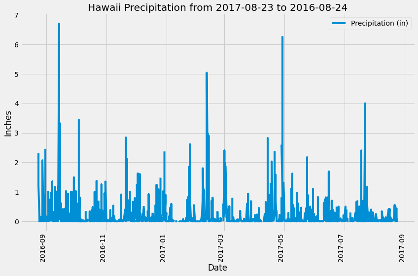
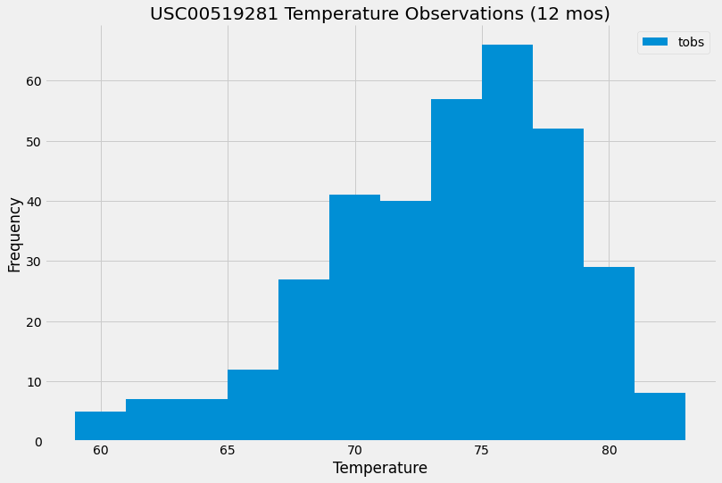

# SQLAlchemy-Challenge

This challenge cconsisted of a hypothetical situation where I'm planning taking a long holiday vacation in Honolulu, Hawaii. I want to try to plan my vacation around Hawaii's weather so I can have the best time possible! In order to do this, I had to use Python and SQLAlchemy ORM queries, as well as Pandas and Matplotlib. Then, I performed some analyses on the climate as well as explore the climate database created. I started by connecting to my SQLite database, and then reflecting my tables into classes Station and Measurement to save references to them. Lastly, I linked my file to the Hawaii database by initializing an SQLAlchemy session, and calling back a Flask API, which stored all the database information.  

### Precipitation Output Plot Figure:

### Most Active Station Histogram Output Figure:

